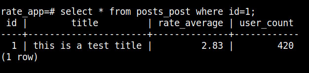
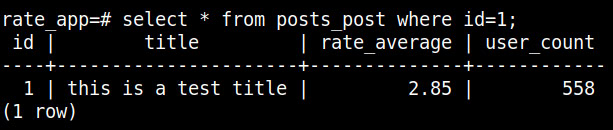
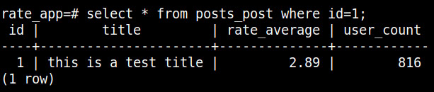
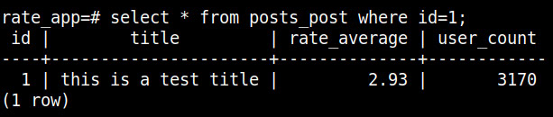
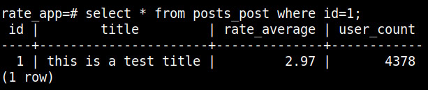

# Rating app

## Project setup

### Local

- Setup virtual environment

```bash
virtualenv env
source env/bin/activate
```

- Install dependencies
```bash
pip install -r requirements.txt
```

- Spin off docker compose
```bash
docker compose up -d
```

- Apply migrations
```bash
python manage.py makemigrations
python manage.py migrate
```

- Run the project
```bash
python manage.py runserver
```

- Start Celery/Beat
```bash
celery -A apps.tasks worker -l info
celery -A apps.tasks beat -l info
```

### Production
In order to run all the project using docker, you can simply run this command:
```bash
docker compose -f compose.dev.yml up -d
```


## API doc
API documentation can be viewed at http://localhost:8000/schema/swagger-ui/

Also, schema yml file can be downloaded at http://localhost:8000/schema/

## Simulation

### Database
In order to create 1000 posts using SQL in docker, you can run the
following command in terminal:
```bash
docker exec -i rating_app-db-1 psql -U postgres -d rate_app <<EOF
INSERT INTO posts_post (title, rate_average, user_count)
SELECT 
    CONCAT('Post ', num) AS title,
    0.0 AS rate_average,
    0 AS user_count
FROM 
    GENERATE_SERIES(1, 1000) AS num;
EOF
```

### Users
Using `Grafana K6` tool, we can simulate the user requests. The script is located in the `simulcation/k6` directory.
More information about the scenario is mentioned in the k6 [README](./simulation/k6/README.md) file.

## Implementation

### High level overview
For this task, `Django` and `Django Rest Framework` is used as the backend sever.
For scheduling and background process, since we had to consider a real product environment,
`Celery` and `Celery Beat` is used. For the sake of simplicity we used `Redis` as the message broker
for django and celery. `PostgresSQL` is used as the primary database.

In the local environment, for ease of development, we only dockerize the Redis and PostgresSQL.
For other stuff we go by normal usage in our local machine.

### Implementation Details
Overall, we have two primary APIs which one is for getting all the posts with related fields,
and the other is for inserting or updating a user rating for a post.

One situation which we should take care is an abnormal behaviour of users sending ratings.
Sometimes maybe there will be high load of ratings and unreal ratings (for example ratings with 4 to 5 for a specific post).

#### Ideas about abnormal ratings situations
- One simple idea is that we can implement a custom rate-limiter with simple conditions. For example when we detect high load
of ratings for a specific post, we don't accept more ratings. The rating average calculation will be the mean of all ratings.
- Another idea is that we use machine learning or AI since this can be considered as an 'Anomaly detection' problem which
there are some algorithms like Isolation Forest, DBSCAN, etc. This solution requires special knowledge about AI and may add
some complexity.
- Another solution is to use 'Weighted Moving Average'. We can compute averages for the posts in an interval, and then
give a weight for each average. For the averages that are created recently, we apply lower weight, and for older averages
we apply higher. This makes the average rating to move harder rather normal average computation.
There is an article about how IMDB is calculating scores which is using same idea: [Link](https://medium.com/@Howto101/how-to-determine-imdb-scores-57281a6a194e)

#### Implemented algorithm for abnormal ratings situations
In this task, we implemented the third idea which is 'Weighted Moving Average'.

Diving into detail, we can compute the new ratings from the users in an interval. Then in another interval
we can calculate the overall rating of the posts using rating averages we had.

So there are 2 background process:
1. calculating rating averages based on the new ratings
2. calculating overall rating average based on the rating averages

**Note**: for the sake of simplicity, we used 1 minute interval for both process, but this
can be something like 6 hours or 1 day in production.

So the first process computes rating averages based on the new ratings received and
not included in any rating average. Then the second process, takes the rating averages and
apply weights for each rating average, then updates rating average and number of users included
in the rating averages for a specific post.

Note that a user can update the rating for a post, but the new rating also will be included in the new rating average. We may think
that this may change the overall rating average because a user is included more than two times, but we can talk about the tradeoffs here.
If we want to take out the old rating of the user from a specific rating average, we should have all the users ids which included in that rating
average. This is a one-to-many relation between RatingAverage and User. Then we should remove the user from that average, compute it another time
and then update it. This takes some effort which in this task we don't accept it, but we can consider it for future and real production environment. 
Also for another solution, we can have some restrictions for the users. For example a user can not add or update a rating for a post more than X times,
but we don't change any rating average then, and we accept the little change for the overall average. This also can be coordinated with business guys.

## Optimizations

### Database
- An optimization we used is connection pooling. Since the number of requests per second is high and each request
creates and closes a database connection of Postgres, we can use a pool of connections and prevent the many time creating-closing
connections. From Django 5.1, connection pooling is support for Postgres: https://docs.djangoproject.com/en/5.1/ref/databases/#connection-pool

- Another optimization can be database indexing. For the specific read queries, we can have simple or compound indexes.

- Pagination is support for GET methods like getting the posts list via limit and offset.

### Asynchronous tasks
Since 'computing rating averages' and 'updating post overall rating and users' are some tasks which take some time and 
may fetch high data, we can not use synchronous django process. Since django is python based and have one process,
it may block other requests.

We should use another tool to process some background or schedule tasks. Since we should assume a production grade product,
`celery` is used as the background process and schedular. Celery can be scaled in a distributed environment and works perfect with
python based applications like Django.

For the message broker we used `Redis`, but other message brokers like `RabbitMQ` or `Kafka` are also
candidates, but for in this application we don't want to make it complex and redis is a good choice.

### Other optimizations to consider
- We can change our queries to avoid multiple queries which can be done via a single query, but also it takes more memory and
maybe more code.
- Celery Beat is configured to do 2 tasks every minute, but we can think about how often is good for processing high number of objects to
prevent the high cpu and memory usage.

## Sample result
Using both k6 simulation and some changes manually in the script, this is a sample result related to the algorithm we have
simulated in the about 6 minutes:

Normal behaviour and user requests:





Potentially increasing the requests:



Reaching high number of users with some of high ratings:



High number of requests with high ratings at the last minute:



**Note**: some requests at the first time were random, but the last minute was high, so the rating average
did not change much. Changing the ratings and scores will result a different average.